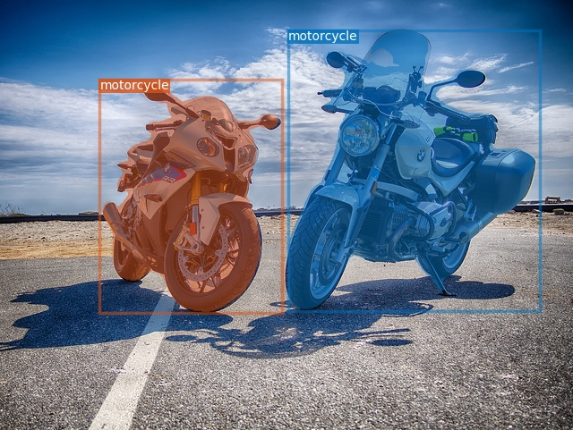
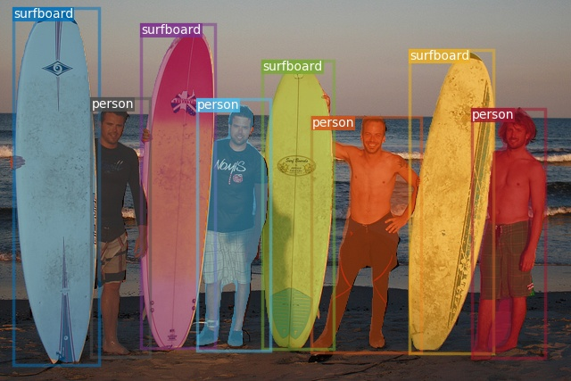
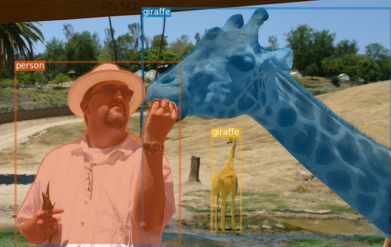
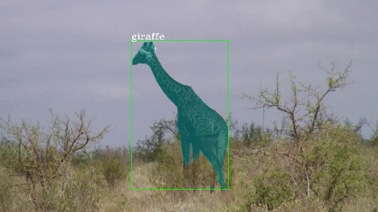

# SipMask
This is the official implementation of "*[SipMask: Spatial Information Preservation for Fast Image and Video Instance Segmentation (ECCV2020)](https://arxiv.org/pdf/2007.14772.pdf)*" built on the open-source mmdetection and maskrcnn-benchmark.

- **Single-stage method for both image and video instance segmentation.**
- Two different versions are provided: **high-accuracy** version and **real-time (fast)** version.
- **Image instance segmentation** is built on both [mmdetection](https://github.com/open-mmlab/mmdetection) and [maskrcnn-benchmark](https://github.com/facebookresearch/maskrcnn-benchmark).
- **Video instance segmentation** is built on [mmdetection](https://github.com/open-mmlab/mmdetection).
- Datasets: [MS COCO](http://cocodataset.org/#home) for image instance segmentation and [YouTube-VIS](https://youtube-vos.org/dataset/vis/) for video instance segmentation.

<table>
    <tr>
        <td ><center> </center></td>
        <td ><center> </center></td>
        <td ><center> </center></td>
    </tr>
</table>
<table>
    <tr>
        <td ><center> </center></td>
        <td ><center> </center></td>
        <td ><center> </center></td>
    </tr>
</table>

## Introduction
Single-stage instance segmentation approaches have recently gained popularity due to their speed and simplicity, but are still lagging behind in accuracy, compared to two-stage methods. We propose a fast single-stage instance segmentation method, called SipMask, that preserves instance-specific spatial information by separating the mask prediction of an instance to different sub-regions of a detected bounding-box. Our main contribution is a novel light-weight spatial preservation (SP) module that generates a separate  set of spatial coefficients for each sub-region within a bounding-box, leading to improved mask predictions. It also enables accurate delineation of spatially adjacent instances. Further, we introduce a mask alignment weighting loss and a feature alignment scheme to better correlate mask prediction with object detection.

## SipMask-benchmark (image instance segmentation)
- This project is built on the official implementation of [FCOS](https://github.com/tianzhi0549/FCOS), which is based on [maskrcnn-benchmark](https://github.com/facebookresearch/maskrcnn-benchmark). 
- High-quality version is provided.
- Please use [SipMask-benchmark](SipMask-benchmark/) and refer to [INSTALL.md](SipMask-benchmark/INSTALL.md) for installation.
- PyTorch1.1.0 and cuda9.0/10.0 are used by me.

#####  Train with multiple GPUs

```shell
python -m torch.distributed.launch --nproc_per_node=4 --master_port=$((RANDOM+10000)) tools/train_net.py --config-file ${CONFIG_FILE} DATALOADER.NUM_WORKERS 2 OUTPUT_DIR ${OUTPUT_PATH}
e.g.,
python -m torch.distributed.launch --nproc_per_node=4 --master_port=$((RANDOM+10000)) tools/train_net.py --config-file configs/sipmask/sipmask_R_50_FPN_1x.yaml DATALOADER.NUM_WORKERS 2 OUTPUT_DIR training_dir/sipmask_R_50_FPN_1x
```
#####  Test with a single GPU

```shell
python tools/test_net.py --config-file ${CONFIG_FILE} MODEL.WEIGHT ${CHECKPOINT_FILE} TEST.IMS_PER_BATCH 4
e.g.,
python tools/test_net.py --config-file configs/sipmask/sipmask_R_50_FPN_1x.yaml MODEL.WEIGHT  training_dir/SipMask_R50_1x.pth TEST.IMS_PER_BATCH 4 
```

- CONFIG_FILE  of Sipmask is under the folder of [SipMask-benchmark/configs/sipmask](SipMask-benchmark/configs/sipmask).


##### Results
|    name   |    backbone     |  input size |  iteration   | ms-train | val. box AP | val. mask AP | download|
| :--------:| :-------------: | :-----------:| :---------: | :-----: | :------: | :------: | :----------: |
| SipMask  |     R50     |  800 &times; 1333|  1x  |   no  |    39.5    |    34.2   |          [model](https://drive.google.com/open?id=11lc6zOSURYca0jCbxH-tNnd6atYyPSf2)         |
| SipMask  |     R101    |  800 &times; 1333  |  3x  |  yes    |    44.1  |    37.8    |       [model](https://drive.google.com/open?id=13_KwrGVE31c7Ts4IqGlwDzzopwZUYb65)         |


## SipMask-mmdetection (image instance segmentation)
- This project is built on [mmdetection](https://github.com/open-mmlab/mmdetection).
- High-quality version and real-time version are both provided.
- Please use [SipMask-mmdetection](SipMask-mmdetection/) and refer to [INSTALL.md](SipMask-mmdetection/docs/INSTALL.md) for installation.
- PyTorch1.1.0, cuda9.0/10.0, and mmcv0.4.3 are used by me.
#####  Train with multiple GPUs

```shell
./tools/dist_train.sh ${CONFIG_FILE} ${GPU_NUM} [optional arguments]
e.g.,
CUDA_VISIBLE_DEVICES=0,1,2,3 ./tools/dist_train.sh configs/sipmask/sipmask_r50_caffe_fpn_gn_1x_4gpu.py 4 --validate
```
#####  Test with a single GPU

```shell
python tools/test.py ${CONFIG_FILE} ${CHECKPOINT_FILE} [--out ${RESULT_FILE}] [--eval ${EVAL_METRICS}] [--show]
e.g., 
python tools/test.py ./configs/sipmask/sipmask_r50_caffe_fpn_gn_1x_4gpu.py ./work_dirs/sipmask_r50_caffe_1x.pth --out results.pkl --eval bbox segm
```

- CONFIG_FILE  of Sipmask is under the folder of [SipMask-mmdetection/configs/sipmask](SipMask-mmdetection/configs/sipmask).


##### Results
|    name     |    backbone     |  input size |  iter.  | ms-train | GN | val. box AP | val. mask AP | download|
| :---------: | :-------------: | :-------------------: | :-----: | :-----: | :-----:| :-----: |:------: | :-----------------: |
|   SipMask   |     R50     |  800&times;1333  |  1x  |   no  |  yes  |    38.2 |    33.5 |  [model](https://drive.google.com/open?id=1t-RSMObxjeSJvHW1tQl8uBUQUU8RKTZO)         |
|   SipMask   |     R50     |  800&times;1333   |  2x  |  yes |   yes  |   40.8 |   35.6  |  [model](https://drive.google.com/open?id=1r7u2WUOuFSWRfRBoWRCADJo7nEchwFzq)         |
|   SipMask   |     R101     |  800&times;1333   |  4x  |  yes |   yes  |   43.6 |   37.8  |  [model](https://drive.google.com/file/d/1kAoZBMk8f1sd7eIlkizv2onnIU5FGOfK/view?usp=sharing)         |
|   SipMask   |     R50     |  544&times;544  |  6x  |  yes |   no  |   36.0 |   31.7  |  [model](https://drive.google.com/file/d/1IFVJN_ZWvF13bqocfFeT42gN2h0F1hFZ/view?usp=sharing)         |
|   SipMask   |     R50     |  544&times;544  |  10x  |  yes |   yes  |   37.1 |   32.4  |  [model](https://drive.google.com/file/d/1B2cr5gK1yM4KDO5DL7snlazFnILLk_2Q/view?usp=sharing)         |
|   SipMask   |     R101    |  544&times;544   |  6x  |  yes |   no  |   38.4 |  33.6  |  [model](https://drive.google.com/file/d/1KrLEKjRzaZ_eiaZ83dIgqQT7V2z1ywA9/view?usp=sharing)         |
|   SipMask   |     R101    |  544&times;544   |  10x  |  yes |   yes  |   40.3 |   34.8 |  [model](https://drive.google.com/file/d/1-KZI9xyoaX-8yEXqgWlqsmrh2buGrFoE/view?usp=sharing)         |
|   SipMask++ |     R101-D    |  544&times;544   |  6x  |  yes |   no  |   40.1 |   35.2 |  [model](https://drive.google.com/file/d/1evdCVqGVKfKrO1RHivuqF1FaDF54gXh9/view?usp=sharing)         |
|   SipMask++ |     R101-D    |  544&times;544   |  10x  |  yes |   yes  |   41.3 |   36.1 |  [model](https://drive.google.com/file/d/1APPkFQ8U4HJ4B8xhcyyn-rB8uOZqJGa7/view?usp=sharing)         |


- GN indicates group normalization used in prediction branch.
- Model with the input size of 800&times;1333 fcoses on high accuracy, which is trained in RetinaNet style.
- Model with the input size of 544&times;544 fcoses on fast speed, which is trained in SSD style.
- ++ indicates adding deformable convolutions with interval of 3 in backbone and mask re-scoring module.

## SipMask-VIS (video instance segmentation)
- This project is an implementation for video instance segmenation based on [mmdetection](https://github.com/open-mmlab/mmdetection). 
- Please use [SipMask-VIS](SipMask-VIS/) and refer to [INSTALL.md](SipMask-VIS/INSTALL.md) for installation.
- PyTorch1.1.0, cuda9.0/10.0, and mmcv0.2.1 are used by me.

Please note that, to run YouTube-VIS dataset like [MaskTrackRCNN](https://github.com/youtubevos/MaskTrackRCNN), install the cocoapi for youtube-vis instead of installing the original cocoapi for coco as follows.
```shell
pip install git+https://github.com/youtubevos/cocoapi.git#"egg=pycocotools&subdirectory=PythonAPI"
or
cd SipMask-VIS/pycocotools/cocoapi/PythonAPI
python setup.py build_ext install
```

#####  Train with multiple GPUs

```shell
./tools/dist_train.sh ${CONFIG_FILE} ${GPU_NUM}
e.g.,
CUDA_VISIBLE_DEVICES=0,1,2,3 ./toools/dist_train.sh ./configs/sipmask/sipmask_r50_caffe_fpn_gn_1x_4gpu.py 4
```

#####  Test with a single GPU

```shell
python tools/test_video.py ${CONFIG_FILE} ${CHECKPOINT_FILE} [--out ${RESULT_FILE}] --eval segm
e.g.,
python ./tools/test_video.py configs/sipmask/sipmask_r50_caffe_fpn_gn_1x_4gpu.py ./work_dirs/sipmask_r50_fpn_1x.pth --out results.pkl --eval segm
```
If you want to save the results of video instance segmentation, please use the following command:
```shell
python tools/test_video.py ${CONFIG_FILE} ${CHECKPOINT_FILE} [--out ${RESULT_FILE}] --eval segm --show --save_path= ${SAVE_PATH}
```

- CONFIG_FILE  of SipMask-VIS is under the folder of [SipMask-VIS/configs/sipmask](SipMask-VIS/configs/sipmask).
- The model pretrained on MS COCO dataset is used for weight initialization.


##### Results
|    name |    backbone     |  input size |  iteration  | ms-train | val. mask AP | download|
| :--------:| :-------------: | :-------------------:| :-----: | :-----: | :------: | :-----------------: |
| SipMask |     R50   |  360 &times; 640  |  1x  |   no  |    32.5     |          [model](https://drive.google.com/file/d/1HIQyzApw6b7CUdTxchZT_TIcGYcDodbn/view?usp=sharing)         |
| SipMask |     R50   |  360 &times; 640  |  1x  |   yes  |    33.7     |          [model](https://drive.google.com/file/d/1BWU8_eaDkGcJ5YEXRzs5oDg6E3adgXWt/view?usp=sharing)         |

- The generated results on YouTube-VIS should be uploaded to [codalab](https://competitions.codalab.org/competitions/20128#participate-submit_results) for evaluation.

## Citation
If the project helps your research, please cite this paper.

```
@article{Cao_SipMask_ECCV_2020,
  author =       {Jiale Cao and Rao Muhammad Anwer and Hisham Cholakkal and Fahad Shahbaz Khan and Yanwei Pang and Ling Shao},
  title =        {SipMask: Spatial Information Preservation for Fast Instance Segmentation},
  journal =      {Proc. European Conference on Computer Vision},
  year =         {2020}
}
```

## Acknowledgement
Many thanks to the open source codes, i.e., [FCOS](https://github.com/tianzhi0549/FCOS), [mmdetection](https://github.com/open-mmlab/mmdetection), [YOLACT](https://github.com/dbolya/yolact), and [MaskTrack RCNN](https://github.com/youtubevos/MaskTrackRCNN).